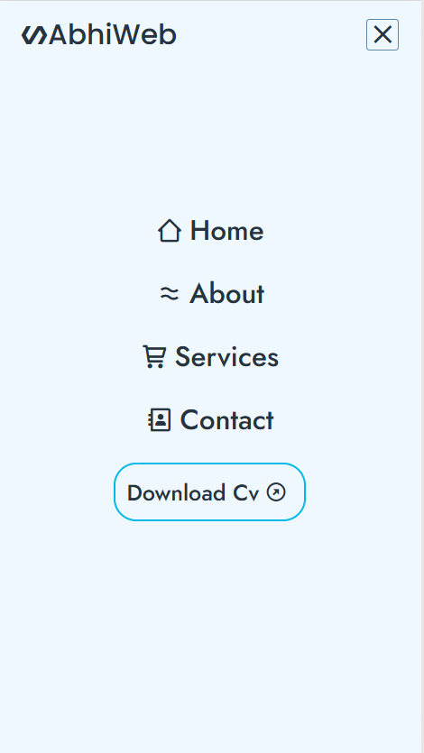

## 🥰 Introducing Our First Basic Reponsive Header
Introducing our first basic responsive header built with HTML, CSS, and a touch of JavaScript. Fully mobile-friendly and easy to customize.

## Features
- Fully responsive design
- Mobile, tablet, and desktop friendly
- Easy to customize colors and layout
- Includes navigation menu toggle for small screens

## Screenshot

## Installation
1. Clone the repo: `git clone https://github.com/abhiraj-codex/Basic-Responsive-Header`
2. Open `index.html` in your browser
3. Customize the CSS and HTML as needed

## Live Demo
[Click Here](https://basic-header.vercel.app/)

## Technologies
- HTML5
- CSS3
- JavaScript 
- Typed.js

## Contributing
Contributions are welcome! Feel free to fork the repo and create a pull request.

## License
This project is licensed under the MIT License.

## Author
Abhiraj Kumar
- Email: 01.abhiraj.kumar.01@gmail.com
- GitHub: [github.com/abhiraj-codex](https://github.com/abhiraj-codex)